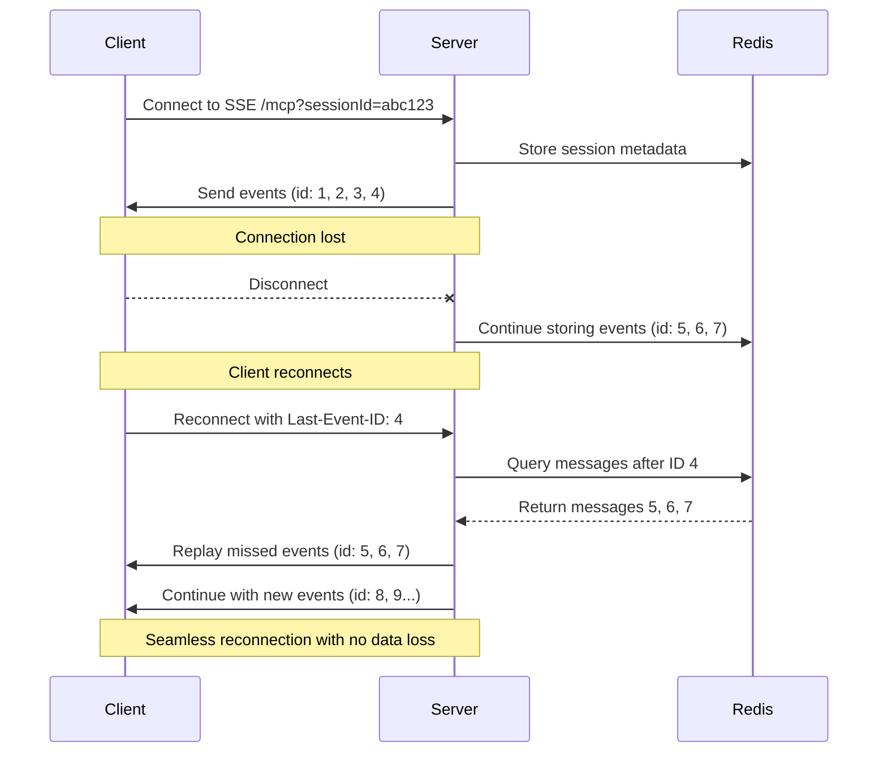
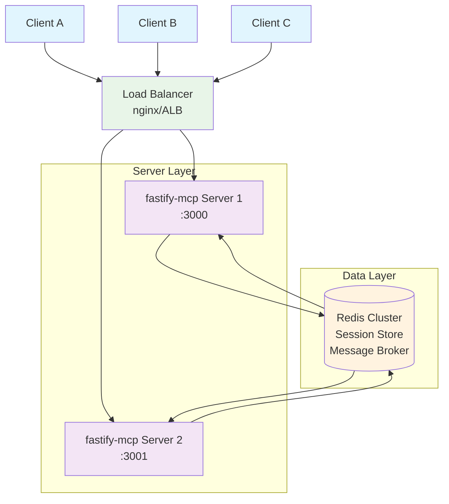

# Announcing fastify-mcp: Production-Ready MCP Server with Horizontal Scaling

Today we're excited to announce **fastify-mcp**, a production-ready Fastify adapter for the Model Context Protocol (MCP) that brings enterprise-grade scalability and type safety to MCP server implementations.

## Why fastify-mcp?

The Model Context Protocol is revolutionizing how AI applications connect to data sources and tools. However, most existing MCP implementations are designed for single-instance development scenarios. As organizations scale their AI applications, they need MCP servers that can handle production workloads with high availability, horizontal scaling, and robust type safety.

fastify-mcp fills this gap by providing:

- **Horizontal Scaling**: Redis-backed session management and message broadcasting
- **High Availability**: Session persistence with automatic reconnection and failover
- **Type Safety**: Complete TypeScript definitions powered by TypeBox
- **Production Ready**: Built on Fastify's battle-tested foundation

## Key Features

### 🚀 **Horizontal Scaling with Redis**

Unlike traditional MCP servers that are limited to single instances, fastify-mcp supports true horizontal scaling:

```typescript
import fastifyMcp from 'fastify-mcp'

const app = fastify()

await app.register(fastifyMcp, {
  redis: {
    host: 'localhost',
    port: 6379
  },
  enableSSE: true
})
```

With Redis configuration, messages sent from any server instance reach all connected clients across the cluster. Session state is shared and persists across server restarts.

### 🔒 **Complete Type Safety with TypeBox**

fastify-mcp leverages TypeBox for runtime type validation and compile-time type safety. The complete MCP protocol is fully typed, including:

- JSON-RPC 2.0 message types (requests, responses, notifications)
- MCP protocol lifecycle (initialization, capabilities, ping)
- Core features: resources, prompts, tools, logging, sampling
- Content types (text, image, audio, embedded resources)

```typescript
import { Type } from '@sinclair/typebox'

app.addMcpTool({
  name: 'file_read',
  description: 'Read file contents',
  inputSchema: Type.Object({
    path: Type.String(),
    encoding: Type.Optional(Type.String())
  }),
  handler: async (params) => {
    // params are fully typed based on schema
    const { path, encoding } = params
    // ...
  }
})
```

### 📡 **Server-Sent Events (SSE) with Session Management**

Real-time streaming communication with robust session management:

- Message history and replay using Last-Event-ID
- Heartbeat mechanism for connection health monitoring
- Cross-instance message broadcasting
- Automatic session cleanup with configurable TTL

#### Session Reconnection & Message Replay

One of fastify-mcp's most powerful features is its ability to handle client reconnections seamlessly. When a client reconnects after a network interruption, the server automatically replays missed messages using the SSE `Last-Event-ID` header. This ensures no data is lost during temporary disconnections.



This mechanism works across server instances in a clustered deployment. If a client reconnects to a different server instance, the session state and message history are retrieved from Redis, ensuring continuity regardless of which server handles the reconnection.

### 🏗️ **Dual Backend Architecture**

Seamless backend selection based on your deployment needs:

- **Memory backends**: Perfect for development and single-instance deployments
- **Redis backends**: Production-ready with cross-instance communication and persistence

The plugin automatically selects the appropriate backend based on configuration—no code changes required.

## Production-Ready Architecture

fastify-mcp is designed from the ground up for production environments with horizontal scaling, high availability, and fault tolerance.



### Horizontal Scaling Architecture

In a production deployment, multiple fastify-mcp server instances work together seamlessly:

- **Load Balancer**: Distributes incoming connections across available server instances
- **Server Instances**: Each server can handle thousands of concurrent connections
- **Redis Cluster**: Provides shared session storage and message broadcasting
- **Session Persistence**: Clients can reconnect to any server instance and resume their session
- **Message Broadcasting**: Events from any server reach all relevant clients across the cluster

### Session Management

Sessions include:
- Metadata storage with automatic TTL (1-hour expiration)
- Message history with configurable limits
- Automatic cleanup and trimming

### Message Broadcasting

- Session-specific message routing
- Broadcast notifications across all instances
- Cross-instance message delivery

## Getting Started

Install fastify-mcp:

```bash
npm install fastify-mcp @sinclair/typebox
```

## Step-by-Step Tutorial: Building a File System MCP Server

Let's build a complete file system MCP server that demonstrates tools, resources, and real-time notifications. This tutorial shows how to create a production-ready server with TypeScript safety and SSE support.

### Step 1: Set up the Server

```typescript
import Fastify from 'fastify'
import { Type } from '@sinclair/typebox'
import mcpPlugin from 'fastify-mcp'

const fastify = Fastify({
  logger: { level: 'info' }
})

// Register the MCP plugin with SSE enabled
await fastify.register(mcpPlugin, {
  serverInfo: {
    name: 'file-listing-server',
    version: '1.0.0'
  },
  capabilities: {
    tools: {},
    resources: {},
    prompts: {}
  },
  instructions: 'A file system listing server that can list files and directories',
  enableSSE: true
})
```

### Step 2: Add a File Listing Tool

Create a tool that lists files in a directory with full TypeScript validation:

```typescript
import { promises as fs } from 'fs'
import { join, relative } from 'path'

const ListFilesSchema = Type.Object({
  path: Type.Optional(Type.String({
    description: 'The directory path to list files from (defaults to current directory)',
    default: '.'
  })),
  showHidden: Type.Optional(Type.Boolean({
    description: 'Whether to show hidden files (files starting with .)',
    default: false
  }))
})

fastify.mcpAddTool({
  name: 'list_files',
  description: 'List files and directories in a given path',
  inputSchema: ListFilesSchema
}, async (params) => {
  const { path = '.', showHidden = false } = params

  try {
    const fullPath = join(process.cwd(), path)
    const items = await fs.readdir(fullPath, { withFileTypes: true })

    const filteredItems = items.filter(item => {
      if (!showHidden && item.name.startsWith('.')) {
        return false
      }
      return true
    })

    const fileList = filteredItems.map(item => ({
      name: item.name,
      type: item.isDirectory() ? 'directory' : 'file',
      path: relative(process.cwd(), join(fullPath, item.name))
    }))

    return {
      content: [{
        type: 'text',
        text: `Found ${fileList.length} items in ${path}:\n\n` +
              fileList.map(item => 
                `${item.type === 'directory' ? '📁' : '📄'} ${item.name} (${item.path})`
              ).join('\n')
      }]
    }
  } catch (error) {
    return {
      content: [{
        type: 'text',
        text: `Error listing files: ${error.message}`
      }],
      isError: true
    }
  }
})
```

### Step 3: Add a File Info Tool

Create a tool that provides detailed file information:

```typescript
const GetFileInfoSchema = Type.Object({
  path: Type.String({
    description: 'The file or directory path to get info about'
  })
})

fastify.mcpAddTool({
  name: 'get_file_info',
  description: 'Get detailed information about a file or directory',
  inputSchema: GetFileInfoSchema
}, async (params) => {
  const { path } = params

  try {
    const fullPath = join(process.cwd(), path)
    const stats = await fs.stat(fullPath)

    return {
      content: [{
        type: 'text',
        text: `File info for ${path}:\n\n` +
              `Type: ${stats.isDirectory() ? 'Directory' : 'File'}\n` +
              `Size: ${stats.size} bytes\n` +
              `Modified: ${stats.mtime.toISOString()}\n` +
              `Created: ${stats.birthtime.toISOString()}\n` +
              `Permissions: ${stats.mode.toString(8)}`
      }]
    }
  } catch (error) {
    return {
      content: [{
        type: 'text',
        text: `Error getting file info: ${error.message}`
      }],
      isError: true
    }
  }
})
```

### Step 4: Add a File Reading Resource

Create a resource that allows reading file contents:

```typescript
const FileUriSchema = Type.String({
  pattern: '^file://read\\?path=.+',
  description: 'URI pattern for file reading with path parameter'
})

fastify.mcpAddResource({
  uriPattern: 'file://read',
  name: 'Read File',
  description: 'Read the contents of a file',
  mimeType: 'text/plain',
  uriSchema: FileUriSchema
}, async (uri) => {
  const url = new URL(uri)
  const filePath = url.searchParams.get('path')

  if (!filePath) {
    return {
      contents: [{
        uri,
        text: 'Error: No file path specified. Use ?path=<filepath>',
        mimeType: 'text/plain'
      }]
    }
  }

  try {
    const fullPath = join(process.cwd(), filePath)
    const content = await fs.readFile(fullPath, 'utf-8')

    return {
      contents: [{
        uri,
        text: content,
        mimeType: 'text/plain'
      }]
    }
  } catch (error) {
    return {
      contents: [{
        uri,
        text: `Error reading file: ${error.message}`,
        mimeType: 'text/plain'
      }]
    }
  }
})
```

### Step 5: Add Real-time File Watching

Create a tool that watches for file changes and sends SSE notifications:

```typescript
import { watch } from 'fs'

const WatchFilesSchema = Type.Object({
  path: Type.Optional(Type.String({
    description: 'The directory path to watch for changes (defaults to current directory)',
    default: '.'
  })),
  watchId: Type.String({
    description: 'Unique identifier for this watch session'
  })
})

fastify.mcpAddTool({
  name: 'watch_files',
  description: 'Watch for file changes in a directory and send notifications via SSE',
  inputSchema: WatchFilesSchema
}, async (params, context) => {
  const { path = '.', watchId } = params
  const sessionId = context?.sessionId

  try {
    if (!sessionId) {
      return {
        content: [{
          type: 'text',
          text: 'Session ID is required for file watching. Make sure you are using SSE.'
        }],
        isError: true
      }
    }

    const fullPath = join(process.cwd(), path)
    const watcher = watch(fullPath, { recursive: true })

    // Handle file change events
    watcher.on('change', (eventType, filename) => {
      if (filename) {
        const notification = {
          jsonrpc: '2.0' as const,
          method: 'notifications/file_changed',
          params: {
            watchId,
            event_type: eventType,
            filename: filename.toString(),
            full_path: join(fullPath, filename.toString()),
            timestamp: new Date().toISOString()
          }
        }

        // Send to specific session
        fastify.mcpSendToSession(sessionId, notification)
      }
    })

    return {
      content: [{
        type: 'text',
        text: `Started watching '${path}' with ID '${watchId}'. File change notifications will be sent via SSE.`
      }]
    }
  } catch (error) {
    return {
      content: [{
        type: 'text',
        text: `Error starting file watcher: ${error.message}`
      }],
      isError: true
    }
  }
})
```

### Step 6: Start the Server

```typescript
try {
  const port = process.env.PORT ? Number(process.env.PORT) : 3000
  await fastify.listen({ port })
  console.log(`🚀 MCP File Listing Server started on port ${port}`)
  console.log('📁 Available tools:')
  console.log('  - list_files: List files in a directory')
  console.log('  - get_file_info: Get detailed file information')
  console.log('  - watch_files: Watch for file changes (requires SSE)')
  console.log('📄 Available resources:')
  console.log('  - file://read?path=<filepath>: Read file contents')
  console.log('\nTo test the server:')
  console.log('  - JSON-RPC requests: POST http://localhost:3000/mcp')
  console.log('  - SSE notifications: GET http://localhost:3000/mcp')
} catch (err) {
  fastify.log.error(err)
  process.exit(1)
}
```

### Testing Your Server

#### Using the MCP Inspector (Recommended)

The easiest way to test your MCP server is with the official MCP Inspector:

```bash
# First, start your server (Node 22+ supports TypeScript natively)
node --experimental-strip-types server.ts

# In another terminal, run the inspector
npx @modelcontextprotocol/inspector http://localhost:3000/mcp
```

This opens an interactive web UI at `http://localhost:6274` where you can:
- **Initialize** the MCP connection
- **Browse available tools** and their schemas
- **Call tools** with a user-friendly interface
- **View resources** and test URI patterns
- **Monitor SSE events** in real-time
- **Inspect all MCP messages** with detailed logging

#### Manual Testing with curl

For direct API testing, you can also use curl:

1. **Test tools with JSON-RPC**:
```bash
curl -X POST http://localhost:3000/mcp \
  -H "Content-Type: application/json" \
  -d '{
    "jsonrpc": "2.0",
    "id": 1,
    "method": "tools/call",
    "params": {
      "name": "list_files",
      "arguments": { "path": ".", "showHidden": false }
    }
  }'
```

2. **Test resources**:
```bash
curl -X POST http://localhost:3000/mcp \
  -H "Content-Type: application/json" \
  -d '{
    "jsonrpc": "2.0",
    "id": 2,
    "method": "resources/read",
    "params": {
      "uri": "file://read?path=package.json"
    }
  }'
```

3. **Test SSE notifications**:
```bash
curl -N -H "Accept: text/event-stream" \
  "http://localhost:3000/mcp?sessionId=test-session"
```

This complete example demonstrates:
- **Type-safe tools** with TypeBox validation
- **Resource handling** with URI patterns
- **Real-time notifications** via SSE
- **Error handling** with proper MCP responses
- **Session management** for stateful operations

## Real-World Use Cases

### Multi-Tenant SaaS Applications

Deploy multiple MCP server instances behind a load balancer, with Redis ensuring session consistency across all instances.

### High-Availability AI Services

Implement automatic failover with session persistence—clients can reconnect to any server instance and resume their session.

### Enterprise AI Platforms

Scale MCP servers horizontally to handle thousands of concurrent AI agents with full type safety and monitoring.

## Performance & Reliability

- **54 comprehensive tests** covering all functionality
- **Memory and Redis backend tests** for reliability
- **Integration tests** for multi-instance deployments
- **Automatic cleanup** with configurable TTL
- **Connection health monitoring** with heartbeat

## TypeScript-First Development

Every aspect of fastify-mcp is designed with TypeScript in mind:

- Complete MCP protocol type definitions
- Runtime validation with TypeBox
- IDE autocompletion and type checking
- Compile-time safety for all MCP operations

## Community & Support

fastify-mcp is open source and built by [Matteo Collina](https://github.com/mcollina), creator of Fastify. The project follows Fastify's proven patterns and best practices.

- **GitHub**: [mcollina/fastify-mcp](https://github.com/mcollina/fastify-mcp)
- **License**: MIT
- **Documentation**: Complete API documentation and examples

## What's Next

We're excited to see how the community uses fastify-mcp to build scalable, production-ready MCP servers. Whether you're building a simple development server or a enterprise-grade AI platform, fastify-mcp provides the foundation you need.

Get started today and join the growing community of developers building the future of AI connectivity with the Model Context Protocol.

---

*fastify-mcp v0.0.1 is available now on npm. Try it out and let us know what you build!*